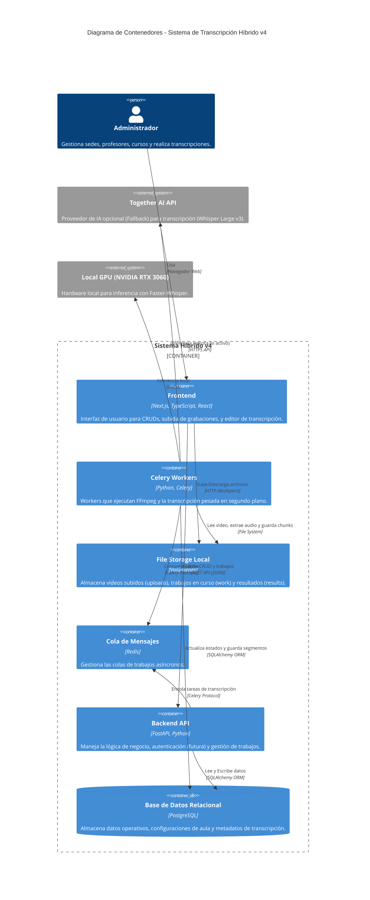
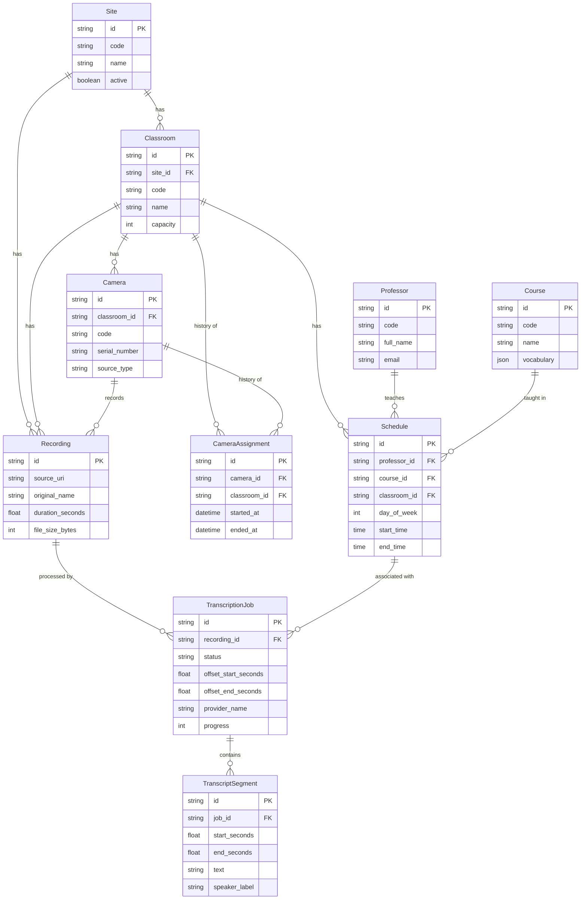
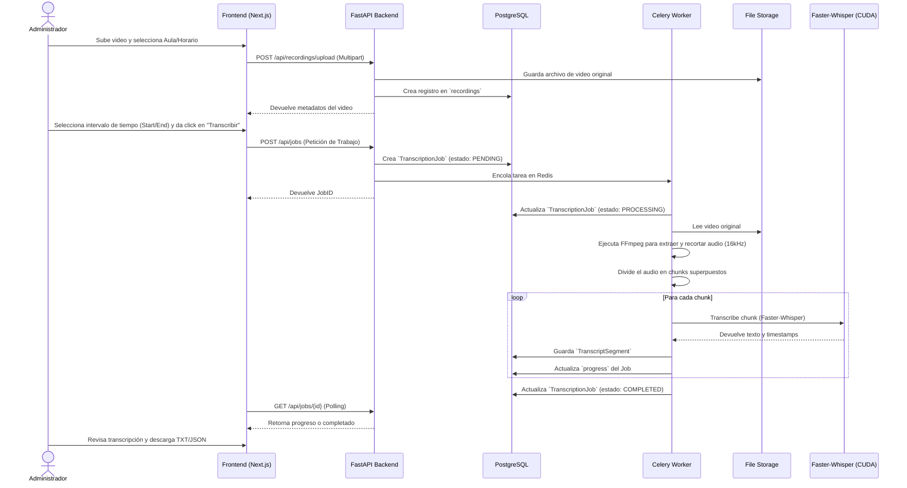

# Arquitectura Detallada del Sistema de Transcripción Híbrido

## 1. Visión General (C4 Model)

## 2. Modelo de Datos (ERD)

## 3. Flujo de Trabajo (Diagrama de Secuencia)

El siguiente diagrama detalla cómo se procesa una grabación, desde el recorte hasta la transcripción final.

## 4. Estrategia de Despliegue Local

Este proyecto está optimizado para funcionar localmente en hardware accesible, específicamente aprovechando una **NVIDIA RTX 3060**.

* **Motor de Inferencia:** Se utiliza `Faster-Whisper` con el modelo `large-v3`.
* **Perfil de Memoria:** Debido a que el modelo `large-v3` es pesado, se utiliza cuantización `int8_float16` que permite correr el modelo dentro de los 12GB de VRAM que tiene la RTX 3060.
* **Concurrencia:** Los workers de Celery se configuran con `concurrency=1` para evitar conflictos en la VRAM y "Out of Memory Errors".
* **Proveedor de Respaldo:** El sistema soporta usar la API de *Together AI* como fallback (cambiando `TRANSCRIPTION_PROVIDER=together` en el `.env`), lo que delega la transcripción a la nube si la GPU local está saturada o no disponible, cobrando solo por el tiempo de los chunks recortados y no por el video completo.
